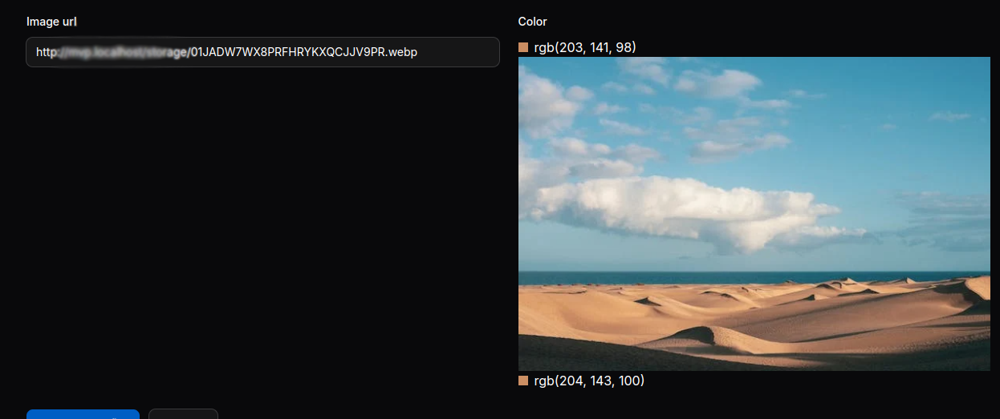

# Image Color Picker for Filament 3

## Install

```bash
composer require wallacemaxters/filament-image-color-picker
```

## Usage

```php
TextInput::make('imagem_url')->url()->live(),
ImageColorPicker::make('cor')
    ->columnSpanFull()
    ->helperText('Move mouse along to image and click to picker the color')
    ->image(fn ($get) => $get('image_url')),
```

## Preview


